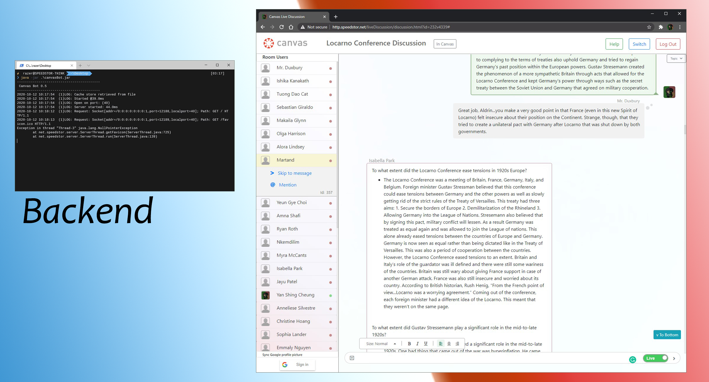

# Live Discussion

[](https://example.com)

Seeing that online discussion is inorganic during COVID, I attempt at improving it by coding this messaging app.

This app have live message sync where people can see what one is typing, in that sending does not need to precede it. It helps in online discussions as there is a immediate feedback on what others are saying, spurring the discussion.
<br/><br/><br/>

## :green_circle: Quick Start
1. Download the stable release [canvasBot.zip](https://github.com/Speedstor/liveDiscussion/releases/tag/stable) here. 
2. Unzip the folder
3. go into the folder and run the `commands` below
```bash
linux / mac
$ sudo java -jar ./canvasBot.jar

windows
PS C:\dir\path> java -jar ./canvasBot.jar
```
<br/>

### ! Need to know

The source code is not updated to the jar excutable in the stable release. I've lost the source code to that. So if you want the updated source code, you would have to use java decompile to get it, sorry :(.


<br/><br/>

###### Made by [speedstor](https://speedstor.net)
